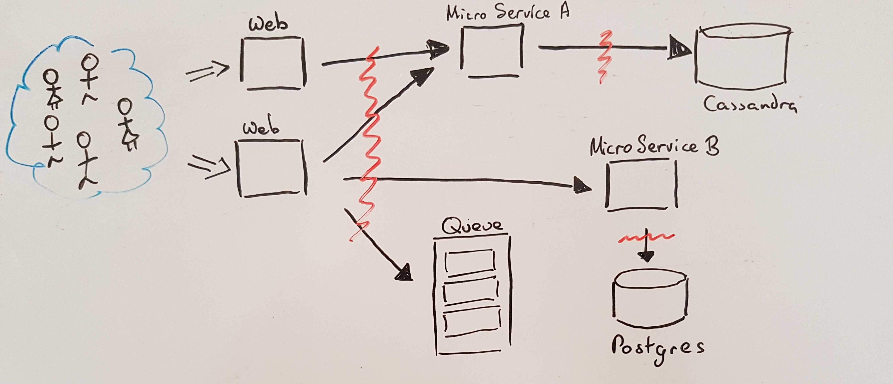
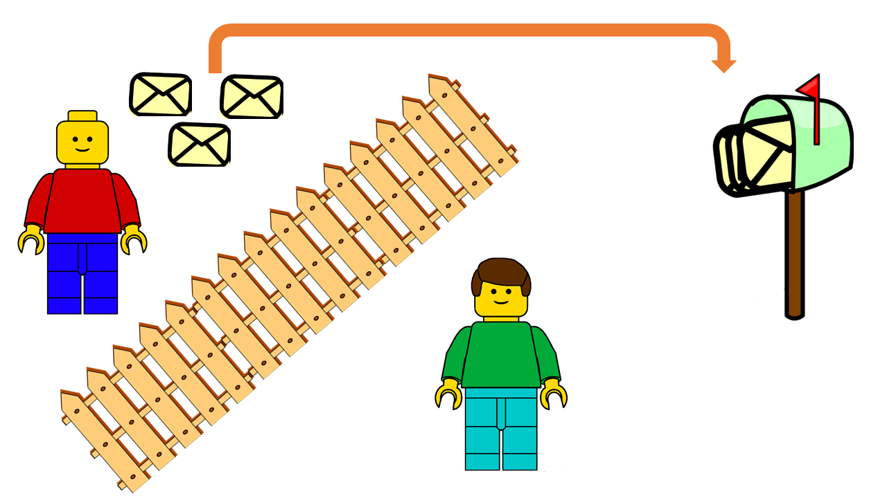
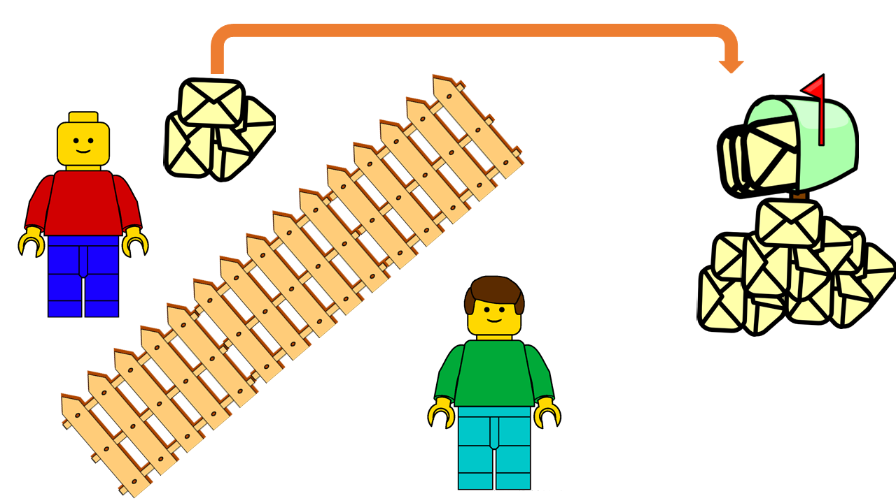
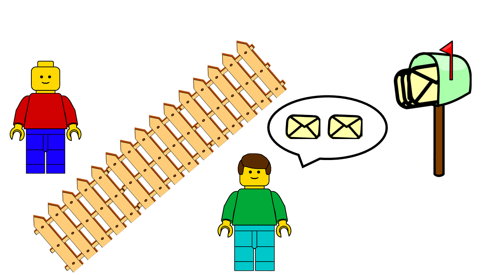
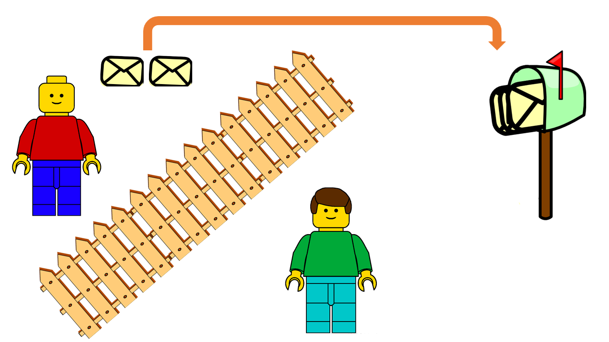
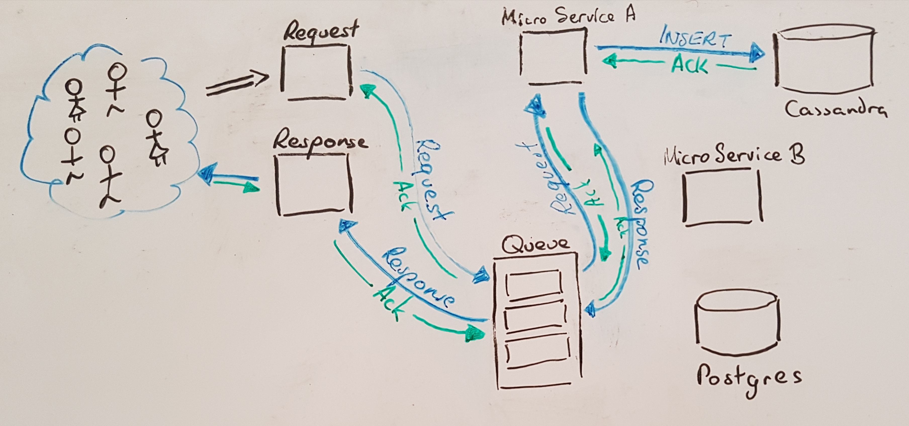
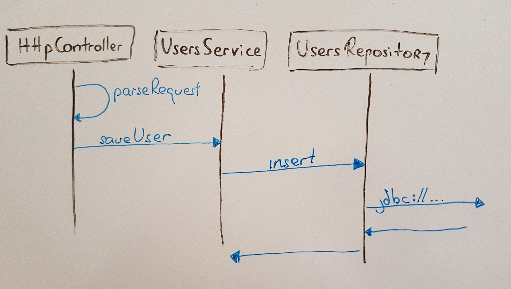
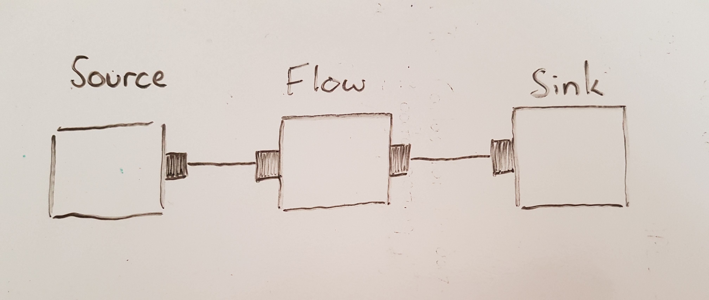
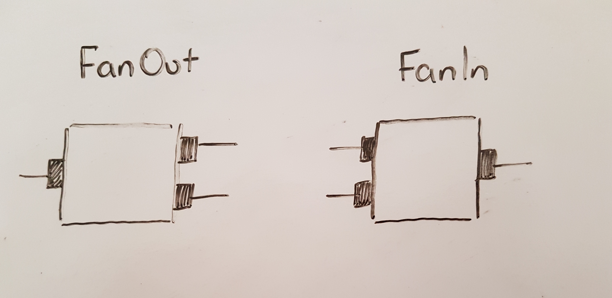
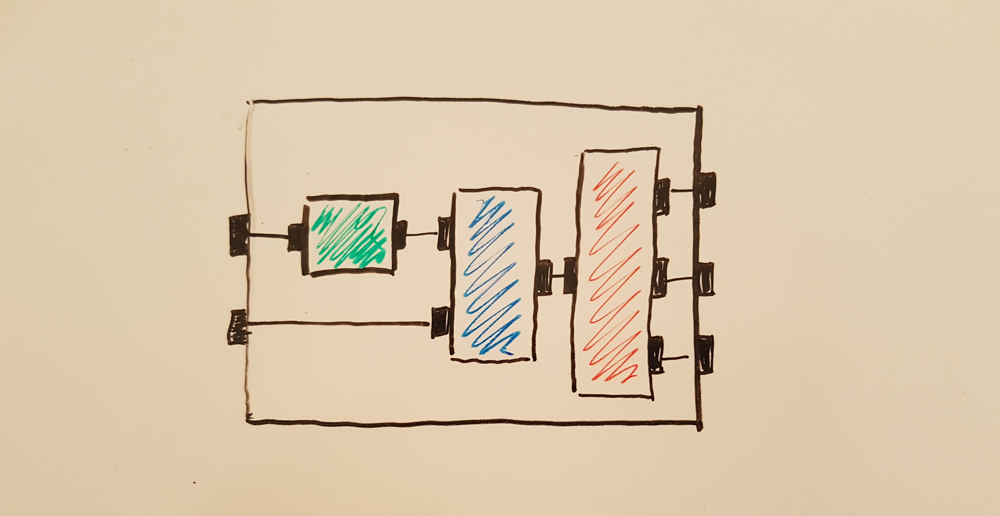

# Akka Streams
### A Brief Introduction

###### Benen Cahill 
###### _10/05/2017_

Note:
LEGO® for Backend Programming
I would say for front end developers too, but unfortunately it's not supported by akka-js directly. 
Integrations exist for akka-http though which front end might find useful

---

### Asynchronous Boundaries



Note:

---

### Asynchronous Boundaries



Note:

---

### Asynchronous Boundaries



Note:

---

### Back Pressure



Note:

---

### Back Pressure



Note:

---

### Back Pressure



Note:

---

### What is Akka Streams?

An implementation of the reactive-streams protocol for Akka

> A common mechanism of how to move data across an asynchronous boundary without 
> losses, buffering or resource exhaustion

Note: 
Akka team were one of the signatories of the Reactive Manifesto

Akka team were also the founding members of the reactive-streams-api (JDK9)

Complexities removed from application developers

Interoperability with other implementations

Built on top of Akka Actors

---

### What is Akka Streams?



Note:
API intended for application developers
Focus on processing on individual elements on stream
An API to compose programs in a manner more akin to how we reason about them 
GraphDSL in somes ways is similar to sequence diagram

---

### What is Akka Streams?

```scala
import GraphDSL.Implicits._

val parseRequest = ???
val validUser = ???
val prepareInsert = ???
val executeJDBC = ???

parseRequest ~> validateUser ~> prepareInsert ~> executeJDBC 
```

Note:
* Yes, we can actually write our applications like this. 
* This is why I think of it as Lego
* You can assemble very very complex graphs, including cyclical

---

### How do I work with Akka-Streams?

1. Define a graph
2. Materialise it
  
Note:
Materialized Value is what can be obtained once the graph has completed it's execution
---

### How do I work with Akka-Streams?


Note:
1. Define element
2. Assemble into a graph
3. Materializer fuses graph together into a concrete representation
4. Fused representation gets implemented as actor
You can have other materializers than Actor, including Futures etc. but Actor seems to be the 
most robust

---
### Basic Stages



Note:
All stage have a shape
Multiple stages can be composed into other stages
All graphs must have at least one source and one sink before they can be run (ClosedShape)

---
### Junctions



Note:
All stage have a shape
Multiple stages can be composed into other stages
All graphs must have at least one source and one sink before they can be run (ClosedShape)

---
### Composed Stages



Note: 
Can combine stages in almost any way we want

---
### Source

Emits elements onto a stream 
```scala
def mySource: Source[Out, MaterializedValue]

val numbers = Source(Seq(1, 2, 3, 4, 5, 6))

val lines = Source.fromIterator(myFile.getLines)

val queue = Source.queue

val actor = Source.actorRef

```

---
### Flow

Apply a transformation to each element 
```scala
def myFlow: Flow[In, Out, MaterializedValue]

val square = Flow[Int].map(n => n * n)

val repeat = Flow[Int].mapConcat(n => immutale.Seq(n, n))

val filter = Flow[Int].filter(_ % 2 == 0)

val lookup = Flow[Int].mapAsync(n)(id => Future { userService.exists(id) })

```
Note: 
looks similar to working with collections
sliding windows
drop

---
### Sink

A description of how to terminate a stream of elements
```scala
def mySink: Sink[In, MaterializedValue]

val discard = Sink.ignore

val gather = Sink.seq

val doSomething = Sink.foreach(elem => ... 

val keep10 = Sink.fold(Seq()){ case (elem, acc) => (acc :+ elem).take(10) }

```
Note: 


---
### FanOut Shapes
Shapes that have one input, but multiple outputs

* Broadcast
* Balance
* Partition

Note: 
---
### FanIn Shapes
Shapes that have multiple inputs, but a single output

* Zip
* Merge

Note: 


---
### A Simple Example

Note:

---

### Custom Shapes

```scala
class Filter[A](predicate: A => Boolean) 
  extends GraphStage[FlowShape[A, A]] {
 
  val in = Inlet[A]("Filter.in")
  val out = Outlet[A]("Filter.out")
 
  val shape = FlowShape.of(in, out)
 
  override def createLogic(inheritedAttributes: Attributes) =
    new GraphStageLogic(shape) {
      setHandler(in, ???)
      setHandler(out, ???)
    }
}
```

---

### InHandler 

```scala
new InHandler {
  override def onPush(): Unit = {
    val elem = grab(in)
    if (predicate(elem)) push(out, elem)
    else pull(in)
  }
}
```

Note: 
* onPush is called when the upstream stage pushes an element downstream
* in this case we get that element
* if it matches the predicate, we push it downstream and wait until we are pulled again
* if it doesn't match, we pull on the upstream again to get a new element

---

### OutHandler

```scala
new OutHandler {
  override def onPull(): Unit = {
    pull(in)
  }
}
```

Note: 
When pulled from downstream, a filter just pulls on it's upstream

---

### Supervision

1. Choose whether to __Stop__, __Restart__, or __Resume__
2. Attach your supervision strategy to your materializer or stage
```
val decider: Supervision.Decider = {
  case _: ArithmeticException => Supervision.Resume
  case _                      => Supervision.Stop
}
```

Note:
Can be attached to the entire materializer
Can be attached to individual shapes
---

## Applications of Akka Streams

* Reducing Actor System Boiler Plate
* Enterprise Integration Patterns (alpakka, reactive-kafka)
* Akka Http (websockets, HTTP2 soon...)
* Monadless Functional Programming

Note:
* Actor System Glue
  * removes ack boiler plating
  * removes dead letters 
  * integrates easily
* Enterprise Integration Patterns
  * Kafka
  * JMS
  * Cassandra  
* Pure Functions
  * GraphDSL
  * Decomposition
  * Reasoning compared with Object Orientated 
  * The idea of your program as LEGO bl

---

## Limitations of Akka Streams

* Typing: `Flow[(A, B, C, D, E, F), G, E]`
* Steep Learning Curve
* Materialisation Expensive
  
Note:
* Downsides:
  * Typing can get heavy
  * Barrier to Entry quite why
  * Materializing can be expensive (short lived streams not really viable)
---

## Thanks

Questions?
